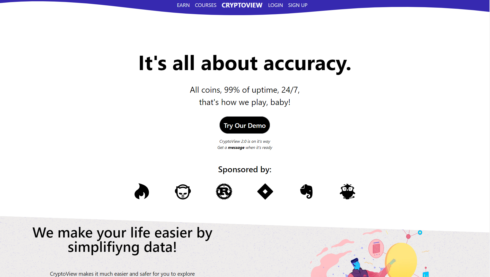

# CryptoView




> CryptoView is a coin hub where you can track the price of the 30 most popular coins in the moment.

### More about CryptoView

Besides showing you info about cryptocurrencies, it features a login/registration system that makes possible for users to create, and login to their accounts.
Plus, it has an Auth system that checks users credentials through a unique token.

## How to run CryptoView locally?

Clone the repo to your computer:
```
git clone https://github.com/wuzue/cryptoview
```

Install npm dependencies:
```
npm i
```

And start the project with: 

```
npm start
```

## How to setup CryptoView server?

First, <a href='https://github.com/wuzue/cryptoview-server'>clone this repository with:</a>
```
git clone https://github.com/wuzue/cryptoview-server
```

Install the server dependencies:
```
npm i
```

And run the server with:
```
nodemon index.js
```

Note: I used MongoDB as a database for CryptoView, if you want to do the same, remember to setup your database there before running the server.
After it is created, create a ```.env``` file in project root folder with a variable with the SAME name as the variable in ```db/dbConnect.js```. By default, it is called DB_URL, but you can name it whatever you want.
And set the value as your MongoDB database key.
for example:
```
DB_URL=mongodb+srv://<YOURUSERNAME>:<YOURPASSWORD>@cluster0.san3z5m.mongodb.net/|<DB>?retryWrites=true&w=majority
```
